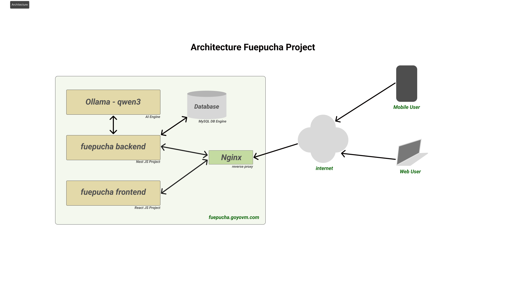

# Hackaton Fuepucha
## Description
A project aimed at detecting and managing profanity in text inputs.
## Architecture
This is the deployment architecture

## Features
- Real-time text analysis
- Customizable white and black lists
- User-friendly interface

## Technology Stack
- React
- TypeScript
- Tailwind CSS
- Node.js (NestJS)
- Ollama (model qwen3).
- MySQL (typeorm)
